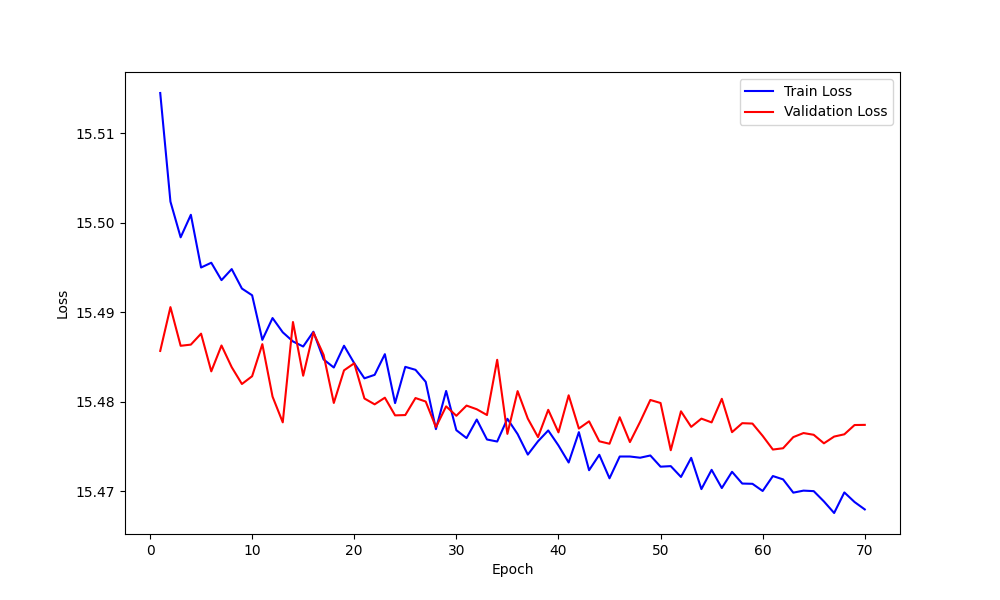
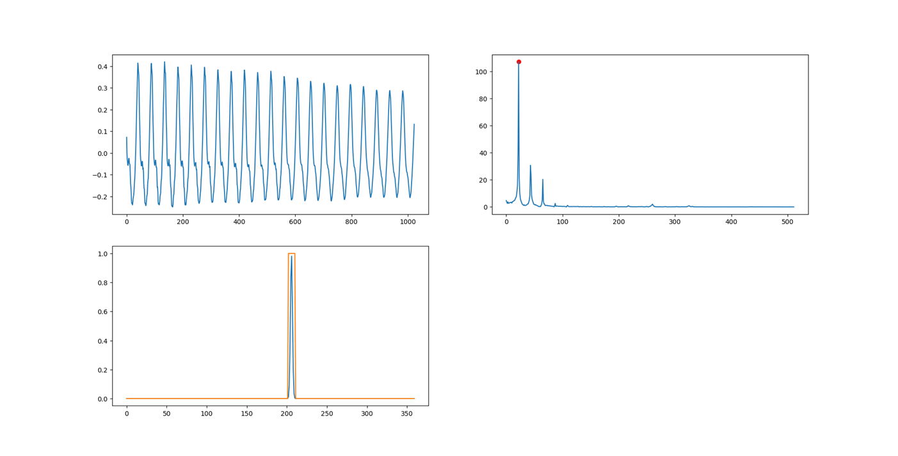
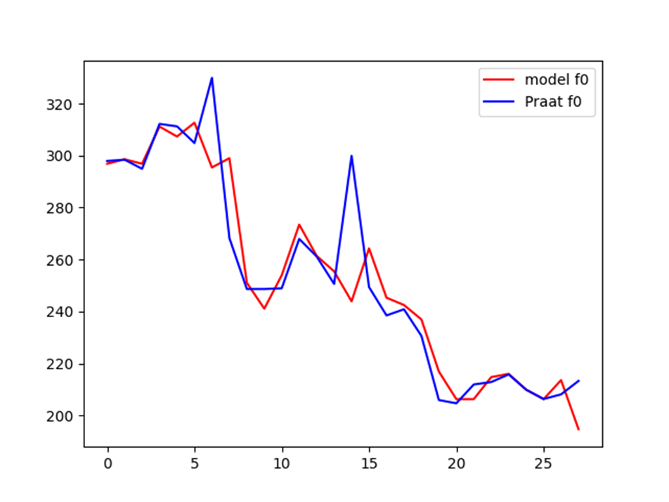

 
# CREPE Pitch Tracker
Using Pytorch to reproduce the CREPE model, with the model structure based on the paper "CREPE: A Convolutional Representation for Pitch Estimation" by Jong Wook Kim, Justin Salamon, Peter Li, and Juan Pablo Bello.

# Train CREPE 
Due to certain doubts about the model structure in the [[paper](https://arxiv.org/abs/1802.06182)]?

A 6-layer convolutional network and a fully connected layer were used during actual training, with Dropout technique applied for regularization. ReLU activation functions were added in the convolutional layers, cross-entropy loss function was used, and a confidence normal distribution was employed to accelerate network fitting.

# Results
During the training process, the changes in the loss curves for the training set and validation set are shown in the figure below. Based on the changes in the loss function, training was stopped at the 50th iteration to save the parameters and prevent overfitting. The figure illustrates the change in average loss for both the training set and the validation set during the training process.

    

After training was completed and actual tests were conducted, the model performed well on the test set.
The first figure shows a sound waveform curve with a length of 0.064ms.
The second figure displays the Fourier spectrum of the sound signal. During the model training and testing process, the Fourier spectrum was also used as a reference.
The third figure shows the model's actual output and the fundamental frequency annotation. The orange line represents the model's actual output with 360-dimensional confidence, and the blue curve indicates the true fundamental frequency annotation.

    

The figure below shows the model's predicted fundamental frequency and the fundamental frequency annotations provided by Praat. The red line represents the predicted fundamental frequency given by the model, while the blue line represents the fundamental frequency provided by Praat using the native autocorrelation algorithm. To maintain consistency with the model's window length, the time step in Praat is set to 64ms.

    

# References
[[1](https://arxiv.org/abs/1802.06182)] Jong Wook Kim, Justin Salamon, Peter Li, and Juan Pablo Bello. _CREPE: A Convolutional Representation for Pitch Estimation_. arXiv:1802.06182 [eess.AS] 17 Feb 2018

# License
This project is based on the structure of the CREPE project.
